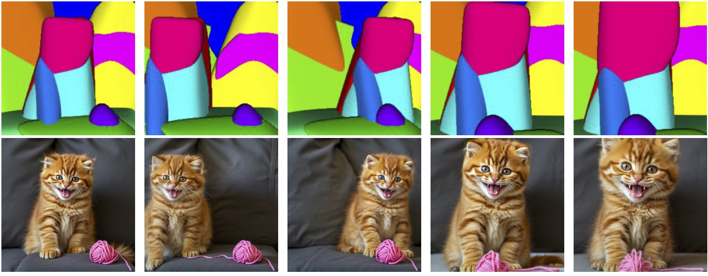
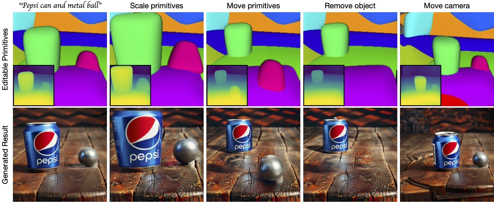

# Generative Blocks World: Moving Things Around in Pictures

**Authors:** Vaibhav Vavilala, Seemandhar Jain, Rahul Vasanth, D. A. Forsyth, Anand Bhattad  
**Paper:** [arXiv:2506.20703](https://arxiv.org/abs/2506.20703)




---

## Abstract

We describe **Generative Blocks World** to interact with the scene of a generated image by manipulating simple geometric abstractions. Our method represents scenes as assemblies of convex 3D primitives, and the same scene can be represented by different numbers of primitives, allowing an editor to move either whole structures or small details. Once the scene geometry has been edited, the image is generated by a flow-based method which is conditioned on depth and a texture hint. Our texture hint takes into account the modified 3D primitives, exceeding texture-consistency provided by existing key-value caching techniques. These texture hints (a) allow accurate object and camera moves and (b) largely preserve the identity of objects depicted. Quantitative and qualitative experiments demonstrate that our approach outperforms prior works in visual fidelity, editability, and compositional generalization.

---

## TL;DR

A 3D-aware image editing framework that represents scenes as convex primitives and uses a depth-conditioned generative model to re-render consistent images after moving objects or the camera.




---

## Code release (To Do)


---

## Citation

```markdown

@misc{vavilala2025generativeblocksworldmoving,
      title={Generative Blocks World: Moving Things Around in Pictures}, 
      author={Vaibhav Vavilala and Seemandhar Jain and Rahul Vasanth and D. A. Forsyth and Anand Bhattad},
      year={2025},
      eprint={2506.20703},
      archivePrefix={arXiv},
      primaryClass={cs.GR},
      url={https://arxiv.org/abs/2506.20703}, 
}

```


